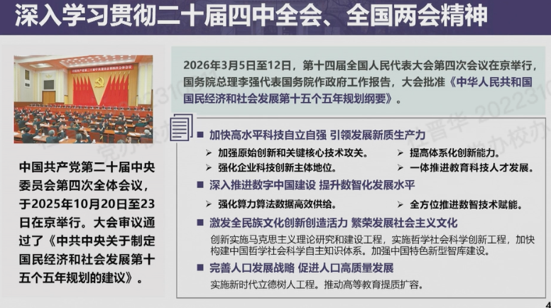

# 党组织生活

## 活动详情

### 2026年3月

2026年春季学期第一次全校党员集中培训暨全校教职工大会
info链接：https://xxbg.cic.tsinghua.edu.cn/oath/detail.jsp?boardid=2712&seq=174947
时间：3月19日（下周四）下午14:00
地点：之后通知
流程：1.培训 2.讨论 3.3月组织生活（学术讨论）4.颁发证书

---

1. 两会相关学习
2. 李路明：讲了学校从十四五到十五五点宏观布局
   1. 清小搭：智能体广场育人生态
   2. 人工智能成为关键词
   3. 实事求是做计划

3. 邱勇：锚定目标，坚定信心，乘势而上，续写中国特色世界一流大学建设新篇章
