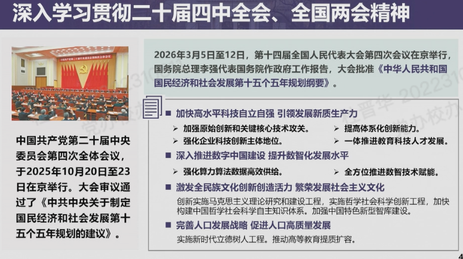

# 组织生活

## 📅 活动一览

> 按时间倒序排列；主题带链接的可查看活动详情稿（位于[组织生活/](组织生活/)目录）。

| 时间 | 主题 | 地点 | 学期 | 类型 |
| :--- | :--- | :--- | :--- | :--- |
| 2026-06-18 19:00 | [六月体育｜码上执杆，智趣同台｜台球教学体验活动](组织生活/2026-06台球.md) | 清华大学西体育馆台球室 | 2026 春季 | 主题实践、组织生活会、联学共建 |
| 2026-06-17 14:00 | 六月智育｜党委委员讲党课 | 自强科技楼 311A+B 会议室 | 2026 春季 | 理论学习、党课、警示教育、组织生活会 |
| 2026-06-11 08:00 | [六月智育｜雁行：天津滨海新区实践](组织生活/2026-06天津实践.md) | 天津滨海新区 | 2026 春季 | 党课、主题实践、组织生活会、联学共建 |
| 2026-05-28 13:00 | [五月德育｜支书为毕业生讲党课暨警示教育｜预备党员转正大会｜政绩观党员集中培训与支部讨论](组织生活/2026-05党课.md) | 自强科技楼 311A+B 会议室 | 2026 春季 | 党课、发展转正、警示教育、联学共建 |
| 2026-04-30 12:00 | [四月劳育｜国家总体安全观&政绩观学习｜我为群众办实事｜毕业生党员活动：国家安全教育暨 AI 网络安全科普](组织生活/2026-04志愿.md) | 北京市海淀区东升镇 | 2026 春季 | 理论学习、主题实践、组织生活会、联学共建 |
| 2026-03-19 14:00 | [2026 年春季学期第一次全校党员集中培训 & 集中讨论 & 三月组织生活：智育](组织生活/2026-03党课.md) | 自强科技楼 311A+B 会议室 | 2026 春季 | 理论学习、党课、组织生活会、联学共建 |
| 2026-03-13 14:00 | [二月组织生活｜《树立和践行正确政绩观学习教育》｜支部民主评议（学校）](组织生活/2026-02党课.md) | 线上 | 2026 春季 | 理论学习、党课、组织生活会 |
| 2026-01-30 17:00 | 一月德育｜理论学习与民主评议｜支部年度总结与计划 | 自强科技楼 301A | 2025 秋季 | 理论学习、党课、警示教育、组织生活会 |
| 2025-12-11 13:30 | 2025 年秋季学期第二次全校党员集中培训 & 集中讨论 & 十二月组织生活：美育浸润，思想升华 | 五教 5101、清华大学艺术博物馆 | 2025 秋季 | 党课、主题实践、组织生活会、联学共建 |
| 2025-11-28 11:30 | 十一月组织生活｜以球会友强体魄，凝心聚力学精神 | 北体育馆、自强科技楼 311A/B | 2025 秋季 | 理论学习、党课、组织生活会、联学共建 |
| 2025-10-24 17:00 | 十月组织生活｜党员发展与转正 | 自强科技楼 301A | 2025 秋季 | 理论学习、发展转正、组织生活会 |
| 2025-10-16 14:00 | 2025 年秋季学期第一次全校党员集中培训 & 集中讨论 & 十月组织生活：抗战精神薪火传，智育科研勇担当 | 自强科技楼 301A | 2025 秋季 | 理论学习、党课、组织生活会、联学共建 |
| 2025-09-26 17:00 | 九月组织生活｜传承红色基因，加强德育建设 | 自强科技楼 312A+312B | 2025 秋季 | 理论学习、党课、发展转正、组织生活会 |
| 2025-09-12 08:00 | 九月雁行主题摄影活动｜支部书记讲党课 | 清华大学南区学生活动中心 B226 | 2025 秋季 | 理论学习、党课、主题实践、组织生活会 |
| 2025-08-21 15:14 | 八月组织生活｜雁行计划｜"数实融合新引擎·智创产业新未来" 软件所学生党支部走进昌平南口 | 北京市昌平区 | 2025 秋季 | 党课、主题实践、组织生活会、联学共建 |
| 2025-07-05 14:00 | 七月组织生活｜雁行计划｜"智惠万家·科技同行" 走进龙岗社区，共启 AI 智慧之门 | 北京市海淀区龙岗社区活动室 | 2025 春季 | 党课、主题实践、组织生活会、联学共建 |
| 2025-06-16 14:00 | 六月组织生活"羽毛球体育活动" & 深入贯彻中央八项规定精神学习教育全校毕业生师生联合主题党日 | 气膜馆羽毛球场 | 2025 春季 | 主题实践、组织生活会、联学共建 |
| 2025-05-27 16:00 | 预备党员转正大会 | 新系馆三层 301B 会议室 | 2025 春季 | 理论学习、发展转正、组织生活会 |
| 2025-05-15 14:00 | 2025 年春季学期第二次全校党员集中培训 & 集中讨论 & 党员自查 & 党员发展大会 & 五月组织生活 | 计算机系新系馆三层 301B | 2025 春季 | 党课、发展转正、组织生活会、联学共建 |
| 2025-04-18 19:00 | 四月体育组织生活：台球联谊活动 & 深入贯彻中央八项规定精神学习教育 & 支部书记讲党课 | 清华大学西体育馆台球厅 | 2025 春季 | 党课、主题实践、联学共建 |

## 📝 活动详情

> ⚠️ 待办：按照学校通知要求，各支部需在本学期内采取"三会一课"、主题党日等方式，开展一次纪律教育、警示教育。

### 2026 年 4 月 班级志愿活动（劳育）✨

各位同学～现招募活动志愿者，欢迎感兴趣同学报名参与（扫码进群即表示报名成功），充实课余实践、凝聚班级力量！

📍 **活动地点**：北京市海淀区文龙家园四里 4 号 悦茂购物中心

⏰ **活动时间**：2026 年 4 月 30 日（周四）15:00-18:00（志愿者需 15:00 前到场，协助前期筹备工作）

📋 **活动流程**：

- 15:00-15:30 二层中庭：问卷发放 + 讲解答疑，东升镇司法所主讲
- 15:30-17:10 四层影院：集体观影
- 17:10-17:30 四层影院：清华五三支部鲁睿同学分享 AI 网络安全知识，含趣味互动
- 17:30-18:00 四层影院外围凭问卷领取活动物资
- 活动结束后：统一组织集体拍照留念

🙋 **志愿工作**：现场秩序维护、物资协助、配合活动开展，轻松简单～

本次参与同学均登记为志愿者，既能学习法治、网络安全实用知识，又能增进班级凝聚力，大家快来报名参加吧！

### 2026 年 3 月 全校党员集中培训

[info 链接](https://xxbg.cic.tsinghua.edu.cn/oath/detail.jsp?boardid=2712&seq=174947)

- 时间：3 月 19 日（周四）下午 14:00
- 流程：1. 培训 → 2. 讨论 → 3. 三月组织生活（学术讨论）→ 4. 颁发证书

内容纪要：

1. 两会相关学习
2. 李路明：学校从十四五到十五五的宏观布局
   1. 清小搭：智能体广场育人生态
   2. 人工智能成为关键词
   3. 实事求是做计划
3. 邱勇：锚定目标，坚定信心，乘势而上，续写中国特色世界一流大学建设新篇章

